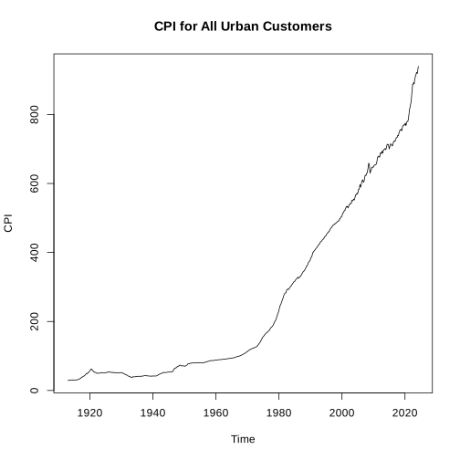
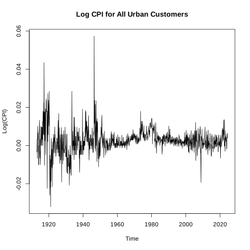
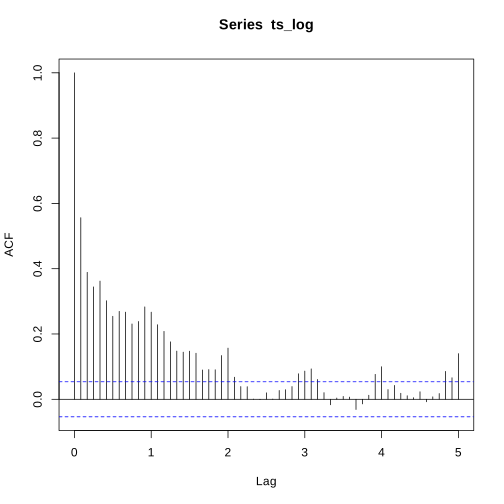
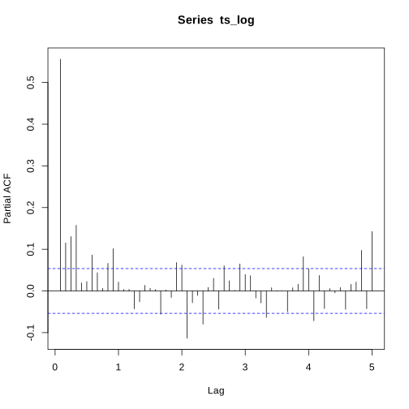
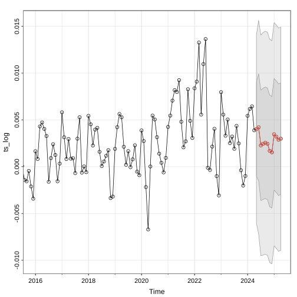
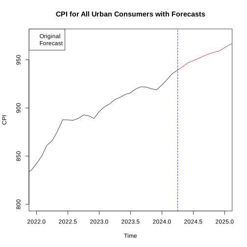
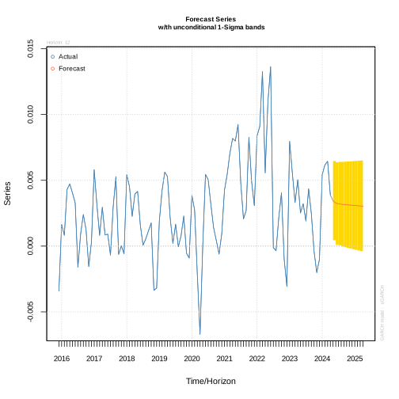
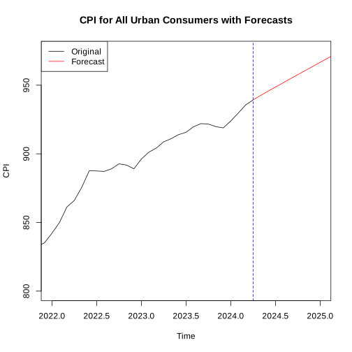

# Time Series Analysis of US CPI

## Installing Dependencies


```R
install.packages("rugarch")
```

    also installing the dependencies ‘truncnorm’, ‘FNN’, ‘kernlab’, ‘mclust’, ‘multicool’, ‘pracma’, ‘DistributionUtils’, ‘GeneralizedHyperbolic’, ‘Rsolnp’, ‘ks’, ‘spd’, ‘chron’, ‘SkewHyperbolic’
    
    
    Updating HTML index of packages in '.Library'
    
    Making 'packages.html' ...
     done
    


```R
library(astsa)
library(forecast)
library(rugarch)
library(lubridate)
```

    Loading required package: parallel
    
    
    Attaching package: ‘rugarch’
    
    
    The following object is masked from ‘package:stats’:
    
        sigma
    
    
    
    Attaching package: ‘lubridate’
    
    
    The following objects are masked from ‘package:base’:
    
        date, intersect, setdiff, union
    
    


## Abstract

The CPI, a critical indicator of inflation, measures the average change in prices paid by urban consumers for a basket of goods and services. Using Bureau of Labor Statistics data dating back to 1913, we can gain valuable insights into long-term inflation trends, economic cycles, and the effects of economic policies on purchasing power.. Given that inflation is one of the leading issues today, examining the CPI will provide a deeper understanding of our circumstance. 

## The Data


```R
#https://data.bls.gov/cgi-bin/surveymost
df <- read.csv("project data.csv")
ts <- ts(df, start = c(1913, 1), frequency = 12)
ts <- ts[, 1]
ts.plot(ts, ylab = "CPI", main='CPI for All Urban Customers')
```


    

    


Upon plotting the Consumer Price Index (CPI) data from the dataset, we observed that the series exhibits non-stationary behavior, characterized by a consistent upward trend. This can complicate Time Series analysis, so a log transformation is applied to stationarize the data, which stabilizes the variance and makes the data more homoscedastic. This transformation is a crucial step in preparing the data for further analysis, as it aligns with the requirements of many time series models that assume stationarity. 


```R
ts_log_1 = log(ts)
ts_log = diff(log(ts))
ts.plot(ts_log, ylab='Log(CPI)',main='Log CPI for All Urban Customers')
```


    

    


We can visually see the effects of the log transformation on the CPI data. This adjustment is clearly observed in the time series plot, where the transformed data exhibits less fluctuation over time, indicating a more stable variance. Consequently, this transformation facilitates the application of statistical methods that assume stationarity, enhancing the reliability of our subsequent time series analysis.

## ACF/PACF


```R
acf_data = acf(ts_log, lag.max = 60)
```


    

    


The Autocorrelation Function (ACF) measures the correlation between an observation and a range of previous observations. It provides insights into the persistence and structure of the data over time. In our analysis, the ACF plot of the original CPI data shows that the autocorrelations do not decline quickly as the lag increases, suggesting that the data exhibits significant autocorrelation over long periods. We can also high autocorrelations at a lag of 3, 4, and 5 possibly exhibiting a monthly seasonality. However, these could be residual autocorrelations left over from the untransformed data. This can obscure underlying seasonal trends. Looking at the PACF can help us see through these residual autocorrelations. 


```R
pacf(ts_log, lag.max=60)
```


    

    


The Partial Autocorrelation Function (PACF) is almost the same as the ACF, however the observed correlation is between the observation and a single previous value rather than a range. By isolating the direct relationship between an observation and its lagged values, the PACF helps identify the underlying structure of the time series, particularly in terms of autoregressive processes. When examining the PACF, significant spikes at specific lags can indicate seasonality, as these suggest a repetitive pattern at those intervals. In this PACF graph, we observe statistically significant PACF values at 5 months. This suggests that the CPI exhibits a recurring pattern every 5 months, reflecting the seasonal nature of consumer price fluctuations. A SARIMA model can model this data well.

## SARIMA Model

A Seasonal Autoregressive Integrated Moving Average (SARIMA) model is an extension of the ARIMA model designed to handle time series data with seasonal patterns. While ARIMA models account for non-seasonal aspects of the data using autoregression (AR), differencing (I), and moving average (MA) components, SARIMA models include additional seasonal terms to capture the repeating patterns at specific seasonal intervals. This makes SARIMA particularly useful for datasets like the CPI, which exhibit seasonal fluctuations. In R, we can identify the best SARIMA model by using the “auto.arima” function with the “seasonal=TRUE” parameter. This function automatically searches through various combinations of ARIMA and seasonal parameters to select the model that best fits the data, optimizing criteria like the Akaike Information Criterion (AIC). By doing this, we ensure that our model effectively accounts for both the non-seasonal and seasonal variations in the CPI data, leading to more accurate forecasts and better insights. 


```R
sarima_fit = auto.arima(ts_log, seasonal = TRUE)
sarima_fit
```


    Series: ts_log 
    ARIMA(1,0,0)(2,0,1)[12] with non-zero mean 
    
    Coefficients:
             ar1     sar1    sar2    sma1    mean
          0.5356  -0.0243  0.1396  0.1133  0.0026
    s.e.  0.0239   0.5427  0.0538  0.5511  0.0004
    
    sigma^2 = 2.546e-05:  log likelihood = 5168.84
    AIC=-10325.68   AICc=-10325.62   BIC=-10294.5


The output from the ARIMA model selection indicates that the best SARIMA model for our time series data is ARIMA(1,0,0)(2,0,1)[12] with a non-zero mean. The accuracy measures AIC, AICc, and BIC are highly negative, further indicating a well-fitted model. Using this model, we can predict future values for the time series, capturing both the trend and seasonal patterns observed in the data, which is crucial for accurate forecasting of the Consumer Price Index (CPI). We can deploy our model on the data to predict future CPI values.


```R
sarima_forecast <- sarima.for(ts_log, n.ahead = 12, p = 1, d = 0, q = 0, P = 2, D = 0, Q = 1, S = 12)
# Print the forecasted values
print(sarima_forecast$pred)
```

                 Jan         Feb         Mar         Apr         May         Jun
    2024                                                 0.004007107 0.004211283
    2025 0.003459969 0.003205208 0.002879326 0.002991934                        
                 Jul         Aug         Sep         Oct         Nov         Dec
    2024 0.002272143 0.002440803 0.002554982 0.002446368 0.001685574 0.001534495
    2025                                                                        


    

    


The forecasting results depicted in the graph show the predicted values for the time series along with their confidence intervals. The forecasted values are marked in red, indicating the continuation of the trend observed in the historical data. The gray shaded area represents the uncertainty of the predictions, expanding as we forecast further into the future. The relatively narrow confidence intervals reflect the model's effectiveness, as indicated by the low AIC and BIC values. These metrics support the reliability of the SARIMA(1,0,0)(2,0,1)[12] model in capturing both the trend and seasonality present in the data, leading to more accurate and meaningful predictions.


```R
sarima_forecast$pred
```


<table class="dataframe">
<caption>A Time Series: 2 × 12</caption>
<thead>
	<tr><th></th><th scope=col>Jan</th><th scope=col>Feb</th><th scope=col>Mar</th><th scope=col>Apr</th><th scope=col>May</th><th scope=col>Jun</th><th scope=col>Jul</th><th scope=col>Aug</th><th scope=col>Sep</th><th scope=col>Oct</th><th scope=col>Nov</th><th scope=col>Dec</th></tr>
</thead>
<tbody>
	<tr><th scope=row>2024</th><td>           </td><td>           </td><td>           </td><td>           </td><td>0.004007107</td><td>0.004211283</td><td>0.002272143</td><td>0.002440803</td><td>0.002554982</td><td>0.002446368</td><td>0.001685574</td><td>0.001534495</td></tr>
	<tr><th scope=row>2025</th><td>0.003459969</td><td>0.003205208</td><td>0.002879326</td><td>0.002991934</td><td>           </td><td>           </td><td>           </td><td>           </td><td>           </td><td>           </td><td>           </td><td>           </td></tr>
</tbody>
</table>


To transplant the predictions from the log-transformed data back onto our original non-stationary data, we need to reverse the transformations we applied initially. First, we need to exponentiate the predicted values to revert the log transformation and add these exponentiated predictions to the last observed value of the original series to ensure continuity. This approach ensures that our forecasts align accurately with the scale and level of the original data, allowing us to extend our historical CPI series with meaningful future values.


```R
# reversed_log_ts <- c(ts_log_1[1], cumsum(c(0, ts_log)))  # Add the first value of log_ts to get back the cumulative log series

# # Convert the log-transformed series back to the original scale by exponentiating
# orig_ts <- exp(reversed_log_ts)

# # Print the original time series (before transformation)
# ts.plot(orig_ts)

last_actual_log <- tail(ts_log_1, 1)[1][1]
ts_tail = tail(ts,1)[1][1]
#last_actual_log

reversed_log_ts = cumsum((c(last_actual_log, sarima_forecast$pred)))
#reversed_log_ts
original_forecasts = exp(reversed_log_ts)


# log_forecasts <- cumsum(c(exp(last_actual_log), exp(sarima_forecast$pred)))
# log_forecasts

# original_forecasts <- log_forecasts


forecast_ts <- ts(original_forecasts, start = end(ts), frequency = frequency(ts))


plot(ts, ylab = "CPI", xlim = c(2022,2025), ylim =c(800,975), main = 'CPI for All Urban Consumers with Forecasts')

# Add the forecasted values in red
lines(window(forecast_ts, start = end(ts)), col = "red")

abline(v = end(ts) + .25, col = "blue", lty = 2)

legend("topleft", legend = c("Original", "Forecast"), col = c("black", "red"))

```


    

    


Another model that might be worth trying is GARCH which is frequently used to model time series data in financial contexts. 

## GARCH Model

The GARCH (Generalized Autoregressive Conditional Heteroskedasticity) model is essential for forecasting time series data with changing volatility, often found in financial and economic datasets. Unlike ARIMA models that focus on the mean, GARCH models capture time-varying volatility. Similar to the SARIMA process, we fit a GARCH model to our log-transformed CPI data and forecast future values.


```R
fit_garch_models <- function(data) {
  models <- list()
  aic_values <- numeric()
  model_names <- character()
  
  ar_orders <- 0:2
  ma_orders <- 0:2
  garch_orders <- 1:2
  arch_orders <- 1:2
  
  for (ar in ar_orders) {
    for (ma in ma_orders) {
      for (p in garch_orders) {
        for (q in arch_orders) {
          spec <- ugarchspec(variance.model = list(garchOrder = c(p, q)),
                             mean.model = list(armaOrder = c(ar, ma), include.mean = TRUE),
                             distribution.model = "norm")
          
          fit <- tryCatch({
            ugarchfit(spec, data)
          }, error = function(e) {
            return(NULL)  # Return NULL if the fit fails
          })
          
          if (!is.null(fit) && all(!is.nan(infocriteria(fit)))) {
            aic <- infocriteria(fit)[1]  # Extract AIC value
            if (!is.na(aic)) {
              models[[paste0("ARMA(", ar, ",", ma, ")-GARCH(", p, ",", q, ")")]] <- fit
              aic_values <- c(aic_values, aic)
              model_names <- c(model_names, paste0("ARMA(", ar, ",", ma, ")-GARCH(", p, ",", q, ")"))
            }
          }
        }
      }
    }
  }
  
  if (length(models) == 0) {
    stop("No valid models were fitted.")
  }
  
  best_model_index <- which.min(aic_values)
  best_model_name <- model_names[best_model_index]
  best_model <- models[[best_model_index]]
  best_model_aic <- aic_values[best_model_index]
  
  return(list(best_model = best_model,
              best_model_name = best_model_name,
              best_model_aic = best_model_aic,
              aic_values = aic_values,
              model_names = model_names))
}


result <- fit_garch_models(ts_log)
best_model <- result$best_model
```


```R
best_model
```


    
    *---------------------------------*
    *          GARCH Model Fit        *
    *---------------------------------*
    
    Conditional Variance Dynamics 	
    -----------------------------------
    GARCH Model	: sGARCH(1,2)
    Mean Model	: ARFIMA(2,0,1)
    Distribution	: norm 
    
    Optimal Parameters
    ------------------------------------
            Estimate  Std. Error    t value Pr(>|t|)
    mu      0.002479    0.000479    5.17542 0.000000
    ar1     1.281299    0.061968   20.67671 0.000000
    ar2    -0.300696    0.058412   -5.14782 0.000000
    ma1    -0.877879    0.007901 -111.10390 0.000000
    omega   0.000000    0.000001    0.46115 0.644689
    alpha1  0.211841    0.032291    6.56040 0.000000
    beta1   0.349641    0.118945    2.93953 0.003287
    beta2   0.437518    0.104691    4.17912 0.000029
    
    Robust Standard Errors:
            Estimate  Std. Error    t value Pr(>|t|)
    mu      0.002479    0.000665   3.729716 0.000192
    ar1     1.281299    0.140303   9.132374 0.000000
    ar2    -0.300696    0.129533  -2.321380 0.020266
    ma1    -0.877879    0.062019 -14.155079 0.000000
    omega   0.000000    0.000013   0.024958 0.980089
    alpha1  0.211841    0.446083   0.474892 0.634864
    beta1   0.349641    0.984946   0.354985 0.722601
    beta2   0.437518    0.572597   0.764094 0.444811
    
    LogLikelihood : 5555.759 
    
    Information Criteria
    ------------------------------------
                        
    Akaike       -8.3112
    Bayes        -8.2801
    Shibata      -8.3113
    Hannan-Quinn -8.2996
    
    Weighted Ljung-Box Test on Standardized Residuals
    ------------------------------------
                             statistic   p-value
    Lag[1]                       3.176 0.0747393
    Lag[2*(p+q)+(p+q)-1][8]      6.701 0.0007410
    Lag[4*(p+q)+(p+q)-1][14]    17.124 0.0002134
    d.o.f=3
    H0 : No serial correlation
    
    Weighted Ljung-Box Test on Standardized Squared Residuals
    ------------------------------------
                             statistic p-value
    Lag[1]                      0.1058  0.7450
    Lag[2*(p+q)+(p+q)-1][8]     0.6283  0.9928
    Lag[4*(p+q)+(p+q)-1][14]    1.1733  0.9992
    d.o.f=3
    
    Weighted ARCH LM Tests
    ------------------------------------
                Statistic Shape Scale P-Value
    ARCH Lag[4]   0.02186 0.500 2.000  0.8825
    ARCH Lag[6]   0.09041 1.461 1.711  0.9898
    ARCH Lag[8]   0.45184 2.368 1.583  0.9854
    
    Nyblom stability test
    ------------------------------------
    Joint Statistic:  125.0532
    Individual Statistics:              
    mu      0.1880
    ar1     0.1240
    ar2     0.1669
    ma1     0.3452
    omega  17.7058
    alpha1  0.6147
    beta1   0.7185
    beta2   0.7180
    
    Asymptotic Critical Values (10% 5% 1%)
    Joint Statistic:     	 1.89 2.11 2.59
    Individual Statistic:	 0.35 0.47 0.75
    
    Sign Bias Test
    ------------------------------------
                       t-value   prob sig
    Sign Bias           0.4909 0.6236    
    Negative Sign Bias  0.2744 0.7839    
    Positive Sign Bias  0.6891 0.4909    
    Joint Effect        1.3288 0.7223    
    
    
    Adjusted Pearson Goodness-of-Fit Test:
    ------------------------------------
      group statistic p-value(g-1)
    1    20     42.12     0.001706
    2    30     54.55     0.002795
    3    40     67.58     0.003039
    4    50     80.84     0.002821
    
    
    Elapsed time : 0.1715572 


The GARCH model fit results indicate that an sGARCH(1,2) model with an ARIMA(2,0,1) mean model and normal distribution provides the best fit for our time series data. The significant coefficients for both the mean and variance equations suggest that the model captures the underlying patterns and volatility dynamics well. However relative to the SARIMA model, the GARCH model has a higher AIC and BIC suggesting a worse fit. 


```R
# Forecasting
garch_forecast <- ugarchforecast(best_model, n.ahead = 12)
plot(garch_forecast, which = 1) # Plot Conditional Mean
```


    

    


The forecasted series, represented by the red line, shows the predicted values extending into 2024 and 2025 with associated uncertainty captured by the yellow 1-sigma bands. The actual data, depicted in blue, fluctuates significantly over the observed period, indicating a volatile series. The forecast suggests a stabilization around the recent trend with a relatively narrow range of uncertainty, implying a moderate level of confidence in the predictions. Despite the model’s confidence, it is unlikely that the forecasted values are accurate given the volatile nature of the CPI prior to the predictions. We can transplant the GARCH  predictions using the same process we used on the SARIMA model.


```R
garch_forecast_values <- as.numeric(garch_forecast@forecast$seriesFor)  # Extract mean forecast values

# Define the start date for the forecast
garch_forecast_start <- as.Date("2024-05-01")  # Adjust based on your data

# Frequency is 12 for monthly data
frequency <- 12

# Create a time sequence for the forecast
garch_forecast_dates <- seq.Date(garch_forecast_start, by = "month", length.out = length(garch_forecast_values))

# Create the time series object for the forecasted values
garch_forecast <- ts(garch_forecast_values, start = c(year(garch_forecast_start), month(garch_forecast_start)), frequency = frequency)

# Print the time series object
print(garch_forecast)
```

                 Jan         Feb         Mar         Apr         May         Jun
    2024                                                 0.003434127 0.003280000
    2025 0.003086532 0.003069463 0.003052881 0.003036767                        
                 Jul         Aug         Sep         Oct         Nov         Dec
    2024 0.003218122 0.003185182 0.003161583 0.003141250 0.003122294 0.003104119
    2025                                                                        


```R
garch_reversed_log_ts = cumsum((c(last_actual_log, garch_forecast)))
#garch_reversed_log_ts
garch_original_forecasts = exp(garch_reversed_log_ts)

# Create the time series for the forecasts
garch_forecast_ts <- ts(garch_original_forecasts, start = end(ts), frequency = frequency)

# Append the forecasts to the original time series


# Plot the original series (in black)
plot(ts, ylab = "CPI", xlim = c(2022,2025), ylim =c(800,975), main = 'CPI for All Urban Consumers with Forecasts', col = 'black')

# Add the forecasted values (in red)
#lines(garch_forecast_ts, col = 'red')
lines(window(garch_forecast_ts, start = end(ts)), col = "red")

# Add vertical line indicating the forecast start
abline(v = end(ts) + .25, col = "blue", lty = 2)

# Add legend
legend("topleft", legend = c("Original", "Forecast"), col = c("black", "red"), lty = 1)

```


    

    


The forecasted values show a similar upward trend in the Consumer Price Index (CPI) to what we saw with the SARIMA model. However, the SARIMA model’s predictions include more of the volatility that is characteristic of the CPI, underpinning the superiority of that model.

## Results

After going over the various accuracy metrics, and visually comparing the predictions of the two models again, we can conclude that the SARIMA model’s predictions are more accurate. The SARIMA model has an AIC and BIC of about -10,325, compared to the GARCH’s measly -8. In addition, the SARIMA model seems to mimic the behavior of the CPI far better, predicting behavior that is hard to discern from the observed data, whereas GARCH’s predictions look extremely linear in comparison.

## Conclusion

According to the SARIMA model's forecast, the Consumer Price Index (CPI) indicates a continued upward trend in prices, suggesting that inflation will persist in the foreseeable future. This projection is critical for policymakers, particularly the Federal Reserve (Fed), as they rely on CPI data to make informed decisions regarding monetary policy. The Fed closely monitors inflation indicators like the CPI to adjust interest rates appropriately, aiming to maintain price stability and support economic growth. By raising interest rates, the Fed can attempt to cool down inflation, while lowering rates can stimulate economic activity. Therefore, the insights gained from the SARIMA model's analysis of the CPI not only provide a clearer picture of future inflation trends but also play a pivotal role in shaping the Fed's strategy for managing the economy.
